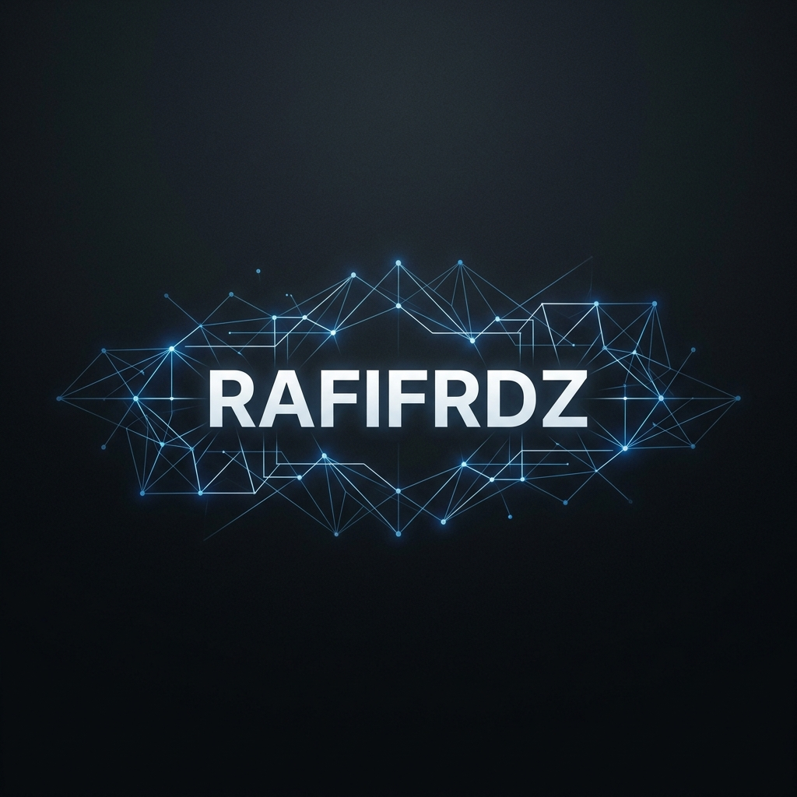

  

# 👋 Hi, I'm Rafifrdz

  

<h3 align="center">Crafting Minimalist Digital Experiences & Scalable Architectures</h3>

  
  

---

### ⚡ About Me

I am a software engineer and designer driven by the philosophy of **"Less is More."** I believe that the most complex problems are best solved through simple, elegant code and intuitive user interfaces.

- 🔭 Currently refining high-performance web systems.
- 🎨 Passionate about aesthetic minimalism and micro-interactions.
- 🧠 Constantly exploring the intersection of AI and user experience.
- 💬 Ask me about UI/UX, Scalability, or TypeScript.

---

### 🛠️ Technical Arsenal

#### **Languages**

  

#### **Frontend & Design**

  

#### **Backend & Infrastructure**

  

---

### 📊 Git Analytics

  
  

  

---

### 📫 Connect With Me

  
  
  

  <i>"Simplicity is the ultimate sophistication." — Leonardo da Vinci</i>

